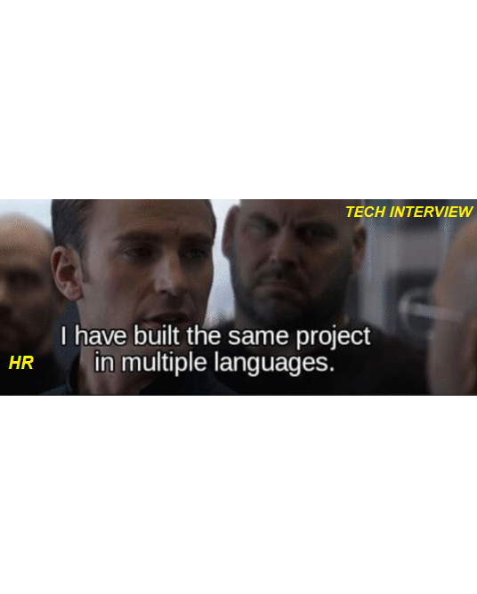

<!--
**smy5152/smy5152** is a ✨ _special_ ✨ repository because its `README.md` (this file) appears on your GitHub profile.
--> Visitor Number

| Stats and Languages |
| ------ |---|
| | |

#### Who am I? I am Spider-Man. Well, not really but its a good dialogue...
#### I am Shabbir from India, been living in Egypt since 2010 & enjoying my life here. I have traveled to Germany, East Africa, and a few asian countries. I currently pursue a _Full Stack Software Developer_ course at [Microverse](http://bit.ly/fullstackdev-free) and look forward to continue living a Nomad life working remotely and traveling across the world.

| #ABOUT ME:|
|------------ | ---|
|### Career
- I have 10+ years of experience in numerous industries:
- Software Development `2005 to 2010`
- Business Analysis & Requirements Engineer `2010 to 2014`
- Agile Product Owner / Product Manager / Digital Marketing Specialist / eCommerce `2014 to Present`
- Student for Life
- Full Stack Dev Student @[Microverse](http://bit.ly/fullstackdev-free)|## 😂 Here is a random joke that'll make you laugh! |

### Expectations VS Reality

### Career:
- I have 10+ years of experience in numerous industries:
- Software Development `2005 to 2010`
- Business Analysis & Requirements Engineer `2010 to 2014`
- Agile Product Owner / Product Manager / Digital Marketing Specialist / eCommerce `2014 to Present`
- Student for Life
- Full Stack Dev Student @[Microverse](http://bit.ly/fullstackdev-free)

### Know me Better:
- 🔭 I’m currently working on graduating as a _[Full Stack Developer - @ Microverse](http://bit.ly/fullstackdev-free)
- 🌱 I’m currently learning ... _HTML5, CSS3, JS, Bootstrap, Ruby, Rails, DSA, Soft Skills_
- 🤔 I’m looking for help with ... _Finding a Job in USA/Canada/EU_
- 💬 Ask me about _[Smycrosoft Inc,.](https://Smycrosoft.com)_
- 📫 How can I help you: _I will build you free eCommerce / Personal / Professional Website if you purchase $2 Hosting_
- 😄 Pronouns: _He/Him_
- ⚡ Fun fact: _When Life Stinks! Go take a bath and get back to Work!_

##### Thanks & Dont be a Stranger
    

| Affiliates| Description |
| :--- | :--- |
|`*`<a href="https://bit.ly/smyhost" target=_blank alt="SSD Unlimited Hosting">SSD Unlimited Hosting</a>|.|
|`*`<a href="https://bit.ly/fullstackdev-free" target=_blank alt="Full Stack Developer">Become A Full Stack Developer</a>|.|
|`*`<a href="https://bit.ly/english-tutors-experts" target=_blank alt="English Fluency">English Tutoring from Native Speakers</a>|.|
